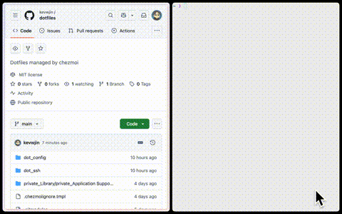
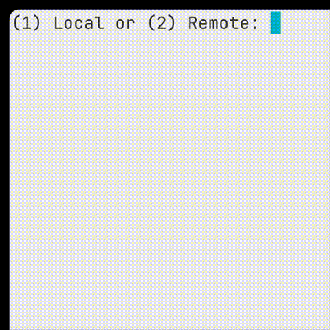
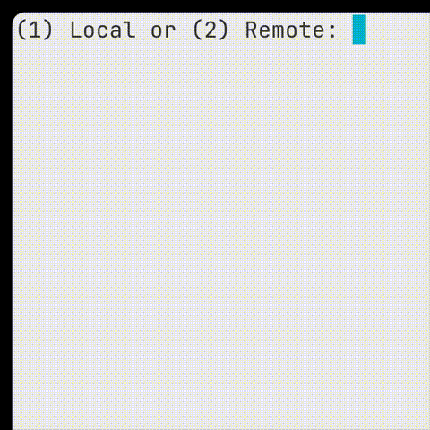

This repo contains config files (for Nvim, Tmux, Zsh, SSH, Git, Yabai, Skhd, SketchyBar, and Ghostty), which with the exception of Yabai, Skhd, and SketchyBar, have package dependencies installable via the Nix flake in the [dotfile-deps](https://www.github.com/kevwjin/dotfile-deps) repo. Chezmoi has conditional logic that applies configurations depending on the system, allowing the config to support MacOS Sequoia and Ubuntu (Oracular Oriole) operating systems.

Chezmoi (pronounced /ʃeɪ mwa/ (shay-mwa)) is used for dotfile management. Chezmoi allows declarative configuration of file attributes through file name prefixes. When applying the config on `chezmoi apply`, for instance, the `dot_<filename>` prefix is replaced with a leading `.` for the filename, and the `private_<filename>` prefix sets the 600 permission for the file. Chezmoi also has age encryption integration, where `chezmoi add --encrypt <filename>` automatically encrypts and manages the file.

These dotfiles also include a `zoom-fullscreen` indicator powered by Yabai, Skhd, and Yabai. The Sketchybar indicator displays when any window in the workspace is in Yabai's zoom-fullscreen mode. Unlike MacOS native fullscreen, zoom-fullscreen maintains window navigation capabilities--you can switch between windows while keeping the focused window visible on top. The GIF illustrates toggling zoom-fullscreen for individual and multiple windows, as well as restoring them to normal size.

&nbsp;

&nbsp;

On MacOS, the Ghostty terminal emulator is configured such that the `~/.config/tmux-startup.sh` script runs upon opening a new Ghostty window, prompting the user to enter a default tmux session locally on the Mac or remotely on the server. @kevwjin personally uses Tailscale to connect between his laptop and server, enabling him to work on his Ubuntu server remotely. The remote access capability is particularly valuable for handling compute-heavy workflows when his server's GPU is needed.

&nbsp;

&nbsp;

&nbsp;

&nbsp;

Another feature is event-based syncing with remote repositories. When opening a Zsh login shell, the zprofile config executes the following sync operations.
1. `update_chezmoi` syncs dotfiles by pulling and applying changes from this repo.
2. `update_nix` syncs dependencies by pulling and applying changes from the [dotfile-deps](https://www.github.com/kevwjin/dotfile-deps) repo.
Consequently, the user profile environment is consistent across my personal MacOS laptop and Ubuntu server.
