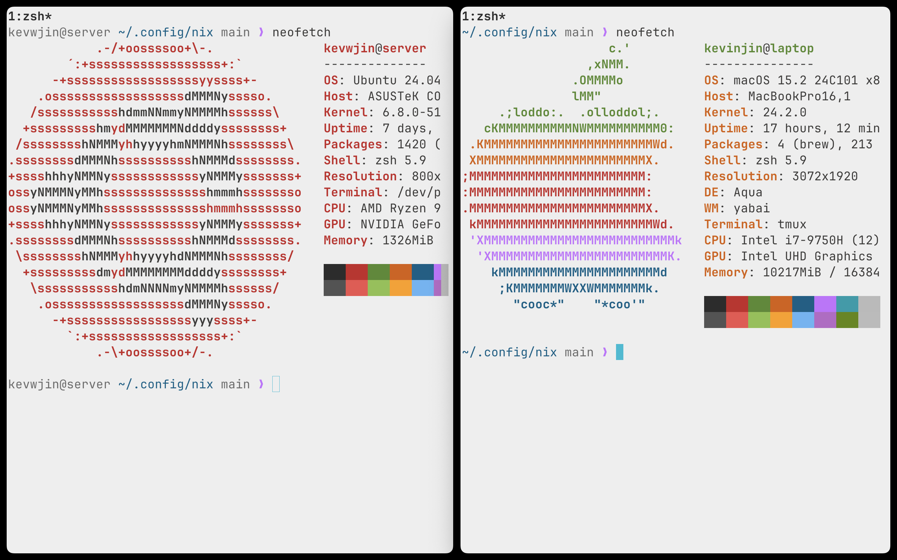
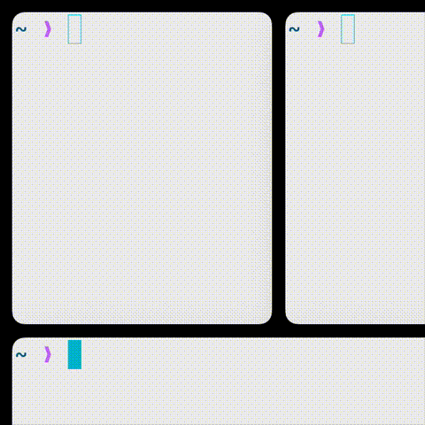
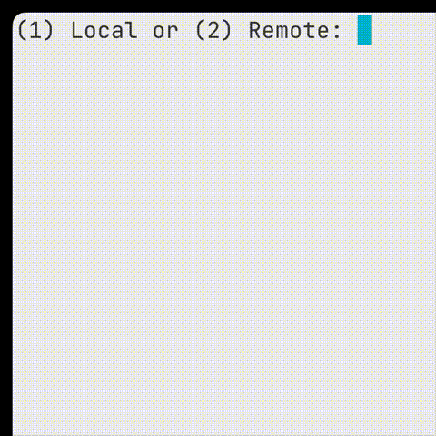
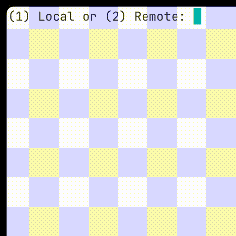

<details>
  <summary>See dotfiles directory structure to depth 4</summary>
  
```console

~/.local/share/chezmoi main ❯ tree . -L 4
.
├── LICENSE
├── README.md
├── dot_config
│   ├── executable_tmux-startup.sh
│   ├── nvim
│   │   ├── init.lua
│   │   └── lua
│   │       ├── config
│   │       ├── core
│   │       └── plugins
│   ├── sketchybar
│   │   ├── plugins
│   │   │   └── executable_fullscreen_indicator.sh
│   │   └── sketchybarrc
│   ├── skhd
│   │   └── skhdrc
│   └── yabai
│       └── executable_yabairc
├── dot_gitconfig
├── dot_p10k.zsh
├── dot_ssh
│   ├── encrypted_id_ed25519.pub.age
│   ├── encrypted_private_authorized_keys.age
│   ├── encrypted_private_id_ed25519.age
│   └── private_config.tmpl
├── dot_tmux.conf
├── dot_zprofile
├── dot_zshenv
├── dot_zshrc
├── empty_dot_hushlogin
└── private_Library
    └── private_Application Support
        └── com.mitchellh.ghostty
            └── config

16 directories, 25 files
```
</details>

#### Intro

This repo contains config files (for Nvim, Tmux, Zsh, SSH, Git, Yabai, Skhd, SketchyBar, and Ghostty), which with the exception of Yabai, Skhd, and SketchyBar, have package dependencies installable via the Nix flake in the [kevwjin/dotfile-deps](https://www.github.com/kevwjin/dotfile-deps) repo.

[Chezmoi](https://www.chezmoi.io/) (pronounced /ʃeɪ mwa/ (shay-mwa)) is used for dotfile management. Chezmoi has conditional logic that applies configurations depending on the system, allowing the config to support **MacOS Sequoia** and **Ubuntu (Oracular Oriole)** operating systems. Chezmoi also allows declarative configuration of file attributes through file name prefixes. When applying the config on `chezmoi apply`, for instance, the `dot_<filename>` prefix is replaced with a leading `.` for the filename, and the `private_<filename>` prefix sets the 600 permission for the file. Chezmoi also has age encryption integration, where `chezmoi add --encrypt <filename>` automatically encrypts and manages the file.

#### Unique Features
- The `zoom-fullscreen` indicator is powered by Yabai, Skhd, and Yabai. The indicator displays when any window in the workspace is in Yabai's zoom-fullscreen mode. Unlike MacOS native fullscreen, zoom-fullscreen maintains window navigation capabilities--you can switch between windows while keeping the focused window visible on top. The GIF illustrates toggling zoom-fullscreen for individual and multiple windows, as well as restoring them to normal size.

&nbsp;
&nbsp;&nbsp;&nbsp;&nbsp;&nbsp;&nbsp;
&nbsp;

- On MacOS, the Ghostty terminal emulator startup script defined at `dot_config/executable_tmux-startup.sh` runs upon opening a new Ghostty window, prompting the user to enter a default tmux session locally on the Mac or remotely on the server. @kevwjin personally uses Tailscale to connect between his laptop and server, enabling him to work on his Ubuntu server remotely. The remote access capability is particularly valuable for handling compute-heavy workflows when his server's GPU is needed.

&nbsp;
&nbsp;&nbsp;&nbsp;&nbsp;&nbsp;&nbsp;
&nbsp;

&nbsp;
&nbsp;&nbsp;&nbsp;&nbsp;&nbsp;&nbsp;
&nbsp;

- Event-based syncing with remote repositories: When opening a Zsh login shell, the `dot_zprofile` script executes the following sync operations: 1) `update_chezmoi` syncs dotfiles by pulling and applying changes from this repo, and 2) `update_nix` syncs dependencies by pulling and applying changes from [kevwjin/dotfile-deps](https://www.github.com/kevwjin/dotfile-deps). Consequently, the user profile environment is consistent across the personal MacOS laptop and Ubuntu server.

#### Per-Tool Config Files

| Tool | Configuration Files |
|------------|-------------------|
| Nvim | `dot_config/nvim/*` |
| Tmux | `dot_tmux.conf` |
| Zsh | `dot_zshrc`, `dot_zprofile`, `dot_zshenv`, `dot_p10k.zsh`, `empty_dot_hushlogin` |
| SSH | `dot_ssh/*` |
| Git | `dot_gitconfig` |
| Yabai | `dot_config/yabai/yabairc` |
| Skhd | `dot_config/skhd/skhdrc` |
| Sketchybar | `dot_config/sketchybar/*` |
| Ghostty | `private_Library/private_Application\ Support/com.mitchellh.ghostty/config`, `dot_config/executable_tmux-startup.sh` |

#### Installation

> > [!WARNING]
> Backup your files before attempting installation. @kevwjin assumes the reader has a high-level understanding of chezmoi and Nix.

Hardware requirements: MacOS Sequoia laptop and Ubuntu Oracular Oriole server

1. Fork [kevwjin/dotfile-deps](https://www.github.com/kevwjin/dotfile-deps) and follow the corresponding README to install dotfile dependencies on both machines.
2. Install [Tailscale](https://tailscale.com/) from the App Store on MacOS and from the apt package manager on Ubuntu. Setup Tailscale and SSH to allow local and remote access to your server from your laptop.
3. Fork this repo and clone your fork to `$HOME/.local/share/chezmoi` on both machines. Set your age encryption key in `~/.config/chezmoi` on both machines. Update the SSH settings and files in the `dot_ssh` directory with your own, and make sure you are using the `--encrypt` flag with the `chezmoi add` command to hide secrets. Update the `dot_gitconfig` file contents with your own.
4. Manually install Ghostty from [their website](https://ghostty.org/).
5. Apply the dotfiles with `chezmoi apply`. If there are diffs, please analyze the diff before proceeding to prevent overwrites of important file content.
6. Push a test commit to your fork, and upon opening any Zsh login shell the dotfiles should sync automatically. The sync is implemented in the `dot_zprofile` file.
7. Follow respective documentation for Yabai, Skhd, and Sketchybar.
8. On MacOS, adjust system settings to auto-hide the top bar and dock.

#### Future Additions
- [ ] Add script so that when moving a window to a different space, automatically focus on that window when changing to that space
- [ ] Migrate the Ubuntu server to NixOS
- [ ] Add cron to server for regular backups to SSDs and AWS Deep Glacier
- [ ] Add Ansible playbook to automate install process of Yabai, Skhd, and Sketchybar with Homebrew
